# ronbun-gather
Automatically collect papers on a regular schedule and notify me via LINE.

## Features
- 🔍 Search papers from arXiv and Google Scholar
- 🈯 Translate abstracts to Japanese using DeepL
- 📝 Save papers to Notion database
- 📱 Send notifications via LINE
- ⏰ Daily automated execution with cron

## System Architecture

```mermaid
graph LR
    subgraph "Input"
        A[Research Keywords<br/>台風・熱帯低気圧関連]
    end
    
    subgraph "Data Collection"
        B[Paper Search<br/>論文検索・取得]
        C[Paper Filtering<br/>関連性チェック]
        D[Duplicate Detection<br/>重複除去]
    end
    
    subgraph "Processing"
        E[Abstract Translation<br/>要約翻訳]
        F[Image Extraction<br/>図表抽出]
    end
    
    subgraph "Output & Storage"
        G[Real-time Notification<br/>リアルタイム通知]
        H[Paper Database<br/>論文データベース]
    end
    
    A --> B
    B -->|arXiv API| C
    C --> D
    D --> E
    D --> F
    E -->|DeepL API| G
    E -->|DeepL API| H
    F --> H
    G -->|LINE Bot API| I[LINE App]
    H -->|Notion API| J[Notion Workspace]
    
    K[Daily Automation<br/>定期実行] --> A
    
    style A fill:#e3f2fd,stroke:#1976d2,stroke-width:2px,color:#000000
    style B fill:#f3e5f5,stroke:#7b1fa2,stroke-width:2px,color:#000000
    style C fill:#f3e5f5,stroke:#7b1fa2,stroke-width:2px,color:#000000
    style D fill:#f3e5f5,stroke:#7b1fa2,stroke-width:2px,color:#000000
    style E fill:#e8f5e8,stroke:#388e3c,stroke-width:2px,color:#000000
    style F fill:#e8f5e8,stroke:#388e3c,stroke-width:2px,color:#000000
    style G fill:#fff3e0,stroke:#f57c00,stroke-width:2px,color:#000000
    style H fill:#fce4ec,stroke:#c2185b,stroke-width:2px,color:#000000
    style I fill:#f5f5f5,stroke:#616161,stroke-width:1px,color:#000000
    style J fill:#f5f5f5,stroke:#616161,stroke-width:1px,color:#000000
    style K fill:#fffde7,stroke:#f9a825,stroke-width:2px,color:#000000
```



## Setup

### Prerequisites
- Python 3.7+
- macOS/Linux (for cron scheduling)

### Installation

1. Clone the repository:
```bash
git clone <repository-url>
cd ronbun-app
```

2. Create a virtual environment:
```bash
python -m venv venv
```

3. Activate the virtual environment:
```bash
source venv/bin/activate
```

4. Install dependencies:
```bash
pip install -r requirements.txt
```

5. Set up environment variables:
```bash
cp .env.example .env
```
Edit `.env` and add your API keys:
- `DEEPL_API_KEY`: Get from [DeepL Pro API](https://www.deepl.com/pro-api) (free 500k chars/month)
- `NOTION_TOKEN`: Get from [Notion Integrations](https://www.notion.so/my-integrations)
- `NOTION_DATABASE_ID`: Your Notion database ID
- `LINE_CHANNEL_ACCESS_TOKEN`: From [LINE Developers](https://developers.line.biz/)
- `LINE_USER_ID`: Your LINE user ID

### Manual Testing

Test individual components:

```bash
# Test DeepL translation
python poc/deepl_test.py

# Test Notion integration
python poc/updated_notion_poc.py

# Test arXiv + DeepL integration
python poc/arxiv_deepl_poc.py

# Run full paper collection
python main.py
```

### Automated Daily Execution

#### Option 1: GitHub Actions (Recommended)

Set up GitHub Actions to run the paper collection automatically every day at 6 PM JST:

1. **Set up GitHub Secrets:**
   Go to your repository → Settings → Secrets and variables → Actions, and add:
   - `DEEPL_API_KEY`: Your DeepL API key
   - `NOTION_TOKEN`: Your Notion integration token
   - `NOTION_DATABASE_ID`: Your Notion database ID
   - `LINE_CHANNEL_ACCESS_TOKEN`: Your LINE bot access token
   - `LINE_USER_ID`: Your LINE user ID

2. **The workflow file is already included** (`.github/workflows/daily-paper-collection.yml`)
   - Runs every day at 18:00 JST (09:00 UTC)
   - Can also be triggered manually from GitHub Actions tab
   - Stores logs as artifacts for 30 days

3. **Enable GitHub Actions:**
   - Go to your repository → Actions tab
   - If prompted, enable GitHub Actions for the repository

#### Option 2: Local Cron (Alternative)

Set up cron (automatic task scheduler) to run the paper collection every day at 6 PM:

1. Open crontab (cron configuration):
```bash
crontab -e
```

2. Add the following line (replace with your actual path):
```bash
0 18 * * * cd /Users/your-username/path/to/ronbun-gather && source venv/bin/activate && python main.py
```

**Explanation of cron format:** `0 18 * * *`
- `0` = minute (0)
- `18` = hour (6 PM)
- `*` = any day of month
- `*` = any month
- `*` = any day of week
- **Result: Runs every day at 6:00 PM**

3. Verify cron setup:
```bash
crontab -l
```

4. Optional: Create logs directory and add logging:
```bash
mkdir logs
```
Then update cron entry:
```bash
0 18 * * * cd /Users/your-username/path/to/ronbun-gather && source venv/bin/activate && python main.py >> logs/daily.log 2>&1
```

## API Setup Guide

### DeepL API
1. Visit [DeepL Pro API](https://www.deepl.com/pro-api)
2. Create free account (500k characters/month)
3. Get API key and add to `.env`

### Notion API
1. Create integration at [Notion Integrations](https://www.notion.so/my-integrations)
2. Create a database with properties: 
   - NAME (title) - Paper title
   - URL (url) - Paper URL  
   - Paper (text) - Summary/notes
   - Date Added (date) - Date added
   - Read (select) - Reading status
   - **Keyword (text) - Search keyword used to find this paper**
3. Share database with your integration
4. Get database ID from URL and add to `.env`

### LINE Messaging API
1. Create channel at [LINE Developers](https://developers.line.biz/)
2. Get channel access token
3. Add bot as friend and get your user ID
4. Add both to `.env`
